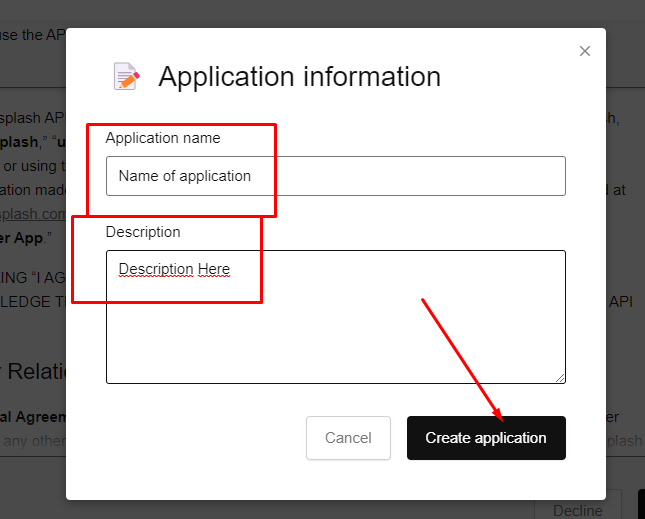

# js-projects

> This repository have projects that I wrote with propose to teach some mentees. I put on github because I hope this can help more people. Enjoy and good learn.

    
<h2>Infinity Scroll</h3>

    <ul>
        <li>Accese the <a href="https://unsplash.com/documentation">api documentation</a></li>
        <li>Click in <b>Register as developer</b></li>
        
        <li>When already login, in the sidebar click on <b>Location</b> located in <i>Schema</i> section</li>
        
        <li>Here have some importants informations about the lib. If you scroll down, you will see the <b>Authorization</b> section with the URL that we will use on fetch and the explanation about <i>YOUR_ACCESS_KEY</i></li>
        
        <li>To get an access key, click in <b>your apps</b> in the header and in <b>New Application</b></li>
        
        <li>Give your <i>Application Name</i> and some <i>Description</i>. After click on <b>Create application</b></li>
        
        <li>Now you have some informations about your <i>production application</i>. If you scroll down, you can see your <b>Keys</b>.</li>
        
        <li>Now you can replace your key in the <code>script.js</code> file and see the application working.</li>
        
    </ul>

    
<h2>Picture in Picture</h3>

    <ul>
        <li>When loaded, you need choose what screen you want share. Ps: a youtube video</li>
        
        <li>After that, you will need to go back to application tab. At this point you will see a notice of which screen you are sharing. Click in <b>Start</b> and a window will overlap all your screens with the screen you chose to share, including games.</li>
        
        <li>You can resize and move this screen as much as you like.</b></li>
    </ul>

    
<h2>Joke Teller</h3>

    <ul>
        <li>Accese the <a href="https://www.voicerss.org/">api documentation</a></li>
        <li>Click in <b>Profile</b> and make a registration</li>
        
        <li>When already login, you will see that your account is inactive. Click in <b>Active account</b> for receive an email.</li>
        
        <li>In your email, search for activation email that API will send to you. Remember to look at the trash. Copy the code, paste in url input and enter.</li>
        
        <li>Now your account is active! Copy the <b>API Key</b></li>
        
        <li>Now you can replace your key in the <code>script.js</code> file and see the application working.</li>
        
    </ul>

<!-- Details Section-->

    

        <h3 align="center"><samp align="center">&#9776; Usefull links</samp></h3>
    

    <a align="center" href="https://zerotomastery.io/cheatsheets/javascript-cheatsheet-the-advanced-concepts/?utm_source=udemy&utm_medium=coursecontent">
        Advanced JavaScript Cheat Sheet
    </a>
     
    <a align="center" href="https://gitmoji.dev/">
        Gitmoji Commits
    </a>
     
    <a align="center" href="https://www.conventionalcommits.org/en/v1.0.0/">
        Conventional Commits
    </a>
     
    <a align="center" href="https://medium.com/linkapi-solutions/conventional-commits-pattern-3778d1a1e657">
        More about <i>Conventional Commits</i>(PT-br)
    </a>

 

<!-- Footer -->
<samp>
    

        ════ ⋆★⋆ ════
         
        "Happy Coding👨‍💻!"
    

</samp>